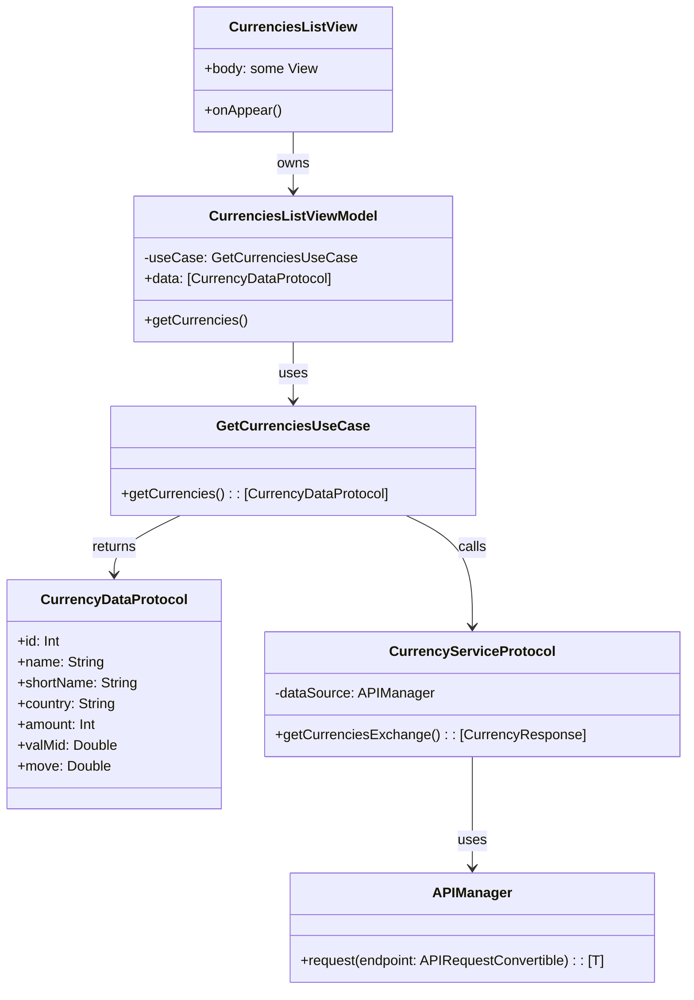

# CSCurrency

This application serves as a homework assignment for an interview. The app fetches data from an open API provided by Erste Group. It displays current exchange rates for available countries. The main focus is on the application architecture, ensuring that it remains easily extensible and testable.

## Application Architecture

The code in the application is structured according to MVVM with Clean Architecture. Below is a UML diagram that illustrates how data retrieval works for the **CurrenciesListView** screen.

### CurrencyListView
A SwiftUI view that displays a list of exchange rates. The list is capable of showing items conforming to *CurrencyDataProtocol*, and these items are rendered using the *CurrencyRow* view. When the screen appears, data is fetched using the view model.

### CurrencyViewModel
A view model that fetches and holds data for the CurrencyListView. Additionally, this view model can prepare information for an alert in case data retrieval fails.

### GetCurrenciesUseCaseProtocol
A use case that retrieves exchange rate data and prepares it for the view model. If an exchange rate does not have a *valMid* (i.e., the value is 0), then the information for that currency is excluded from the final array.

### CurrenciesServiceProtocol
A service that fetches raw exchange rate data via a repository. In the application, the repository is the APIManager class, which handles making requests to the server.

## Testing

Each layer can be tested independently. Test examples are written using the internal iOS XCTest framework.

- **Service Tests:** These tests ensure that data is correctly parsed into the response structure.
- **Use Case Tests:** These tests verify that the subject under test retrieves the correct data from the service and is able to transform it into the expected result.
- **ViewModel Tests:** These tests check the functionality of public methods and properties, ensuring both success and failure states are handled appropriately.

When building views, it is possible to generate test data from the same source used for testing. Thus, views can be directly created using expected data without the need for additional example structures.

## Further Improvements

- **Coordinator System:** The application currently does not have a coordinator system for better screen navigation management. For simplicity, it was built using the SwiftUI lifecycle. Due to time constraints, a coordinator system was not implemented.
- **Dependency Injection:** Dependency injection is not fully implemented. Each system could use different implementations (for example, one for production and one for testing). It is necessary to complete a dependency injection container where all dependencies are defined. This would result in cleaner code and reduce the number of lines needed to initialize each view model.
- **Environment Targets:** The open API offers both a sandbox mode and a production mode. Consequently, the application could be split into two targets: beta and production. For code separation, it would be beneficial to define flags at the project level, along with the URLs for the servers.
